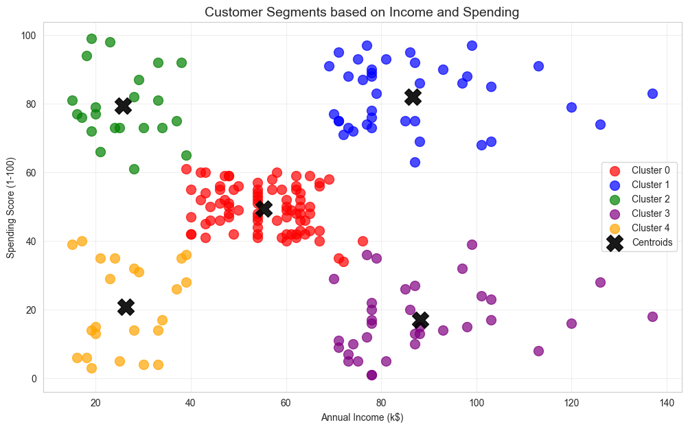
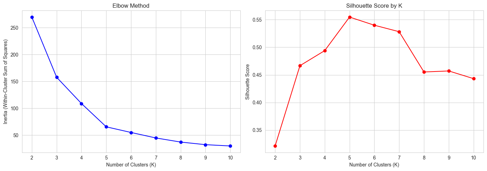
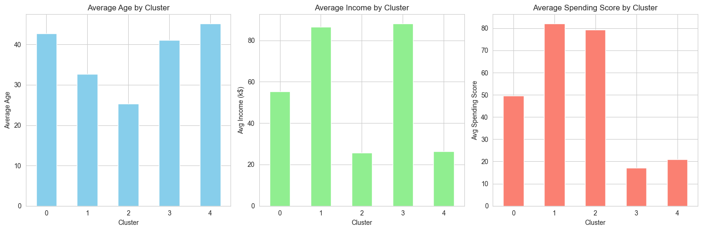

# Customer Segmentation with K-Means Clustering

A machine learning project that groups mall customers into distinct segments based on their income and spending patterns, helping businesses move beyond one-size-fits-all marketing.

## Why This Project

Most businesses treat their customers as one big group, but a premium customer responds differently than a budget-conscious one. Finding natural groupings in customer data lets marketing teams personalize their approach, which usually means higher engagement and better conversion rates. This project uses unsupervised learning to find those groupings automatically, without any predefined labels.

## Dataset

Source: Mall Customer Segmentation Data (from Kaggle)
Size: 200 customers
Features: 5 columns including gender, age, annual income, and spending score
Target: None - this is unsupervised learning, so the model has to find groups on its own

## What I Did

Explored the data: looked at age, income, and spending score distributions across customers
Visualized relationships: created scatter plots that already hinted at natural customer groupings
Scaled the features: used StandardScaler so income and spending score would be weighted equally
Found the optimal number of clusters: used both the Elbow Method and Silhouette Score across K values 2 to 10
Applied K-Means clustering with K=5, the optimal value identified by both methods
Profiled each cluster by average age, income, and spending behavior
Assigned business-friendly segment names and recommended marketing strategies for each group

## Results

The model produced 5 well-separated customer segments:

| Segment | Income Level | Spending Behavior | Strategy |
|---------|--------------|-------------------|----------|
| Premium | High | High | Loyalty programs, VIP service |
| Cautious Affluent | High | Low | Quality-focused marketing |
| Average | Mid | Mid | Standard promotions |
| Risk Takers | Low | High | Installment plans, rewards |
| Budget-Conscious | Low | Low | Discounts, value bundles |

Silhouette Score: 0.47 (indicates well-separated clusters)
Optimal K identified by both Elbow Method and Silhouette Score

## Charts

### Customer Clusters (Income vs Spending)

### Finding the Optimal Number of Clusters

### Cluster Characteristics

## What I Learned From the Data

Customers naturally fall into 5 groups based on income and spending behavior
High-income customers split into two very different groups: big spenders and cautious savers
A surprising segment of low-income customers spends heavily, suggesting price-sensitivity isn't always the main driver
The largest single group is "Average" customers with moderate income and moderate spending
Income alone doesn't predict spending behavior - personality and lifestyle play a big role

## Business Suggestions

Build a VIP program targeting Premium customers since they generate the highest revenue per customer
Create quality-focused campaigns for Cautious Affluent customers who have money but spend carefully
Offer installment plans and loyalty rewards to Risk Takers who tend to overspend
Bundle low-cost value packs for Budget-Conscious customers
Use these segments to personalize email campaigns instead of sending the same message to everyone

## Tools Used

Python 3.11
pandas, NumPy
scikit-learn (KMeans, StandardScaler, silhouette_score)
matplotlib, seaborn

## How to Run

Install the dependencies and open the notebook:
